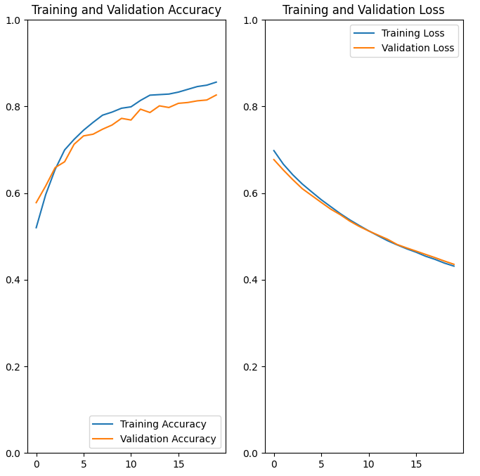

# Kinder Guardtoon : 웹툰의 선정성 여부를 판단하는 CV 모델 개발 프로젝트
- 웹툰 컷이 선정적인지를 판별하는 CV 모델을 개발할 때 사용된 코드입니다. 
- 해당 코드는 KinderGuardtoon(23년도 고려대학교 인공지능 SW 아카데미에서 진행한 프로젝트 CV 프로젝트)에 활용되었습니다. 
- 구글 코랩(Colab) 환경에서 실행 가능하며, 데이터 전처리 → 모델 학습 → 평가 → 결과 시각화 과정을 포함합니다.

## 프로젝트 개요
- 모델: ConvNeXtBase (imagenet 사전학습 가중치 사용)
- 데이터 전처리: tf.keras.applications.convnext.preprocess_input
- 전략: Feature Extractor 방식 (기존 ConvNeXtBase를 동결하고 Custom Dense Layer로 학습)
- 활용 사례: 이진 분류(Binary Classification) 및 다중 클래스 분류(Class Classification) 확장 가능

## 시작하기
1. 요구사항 설치
```
pip install tensorflow keras matplotlib split-folders pandas
```
2. Google Drive 마운트
- Colab에서 실행 시 드라이브를 연결하여 데이터셋을 불러옵니다:
```
from google.colab import drive
drive.mount('/content/drive')
```
3. 데이터 준비
- 데이터셋은 클래스별 폴더 구조로 준비합니다:
```
dataset/
 ├── train/
 │    ├── class1/
 │    └── class2/
 ├── val/
 │    ├── class1/
 │    └── class2/
 └── test/
      ├── class1/
      └── class2/
```

- split-folders 라이브러리를 활용해 자동 분리도 가능합니다.
```
import splitfolders
splitfolders.ratio("raw_dataset", output="dataset", seed=1337, ratio=(.8, .1, .1))
```

## 모델 관련 코드
### 모델 구조
```
from tensorflow.keras.applications import ConvNeXtBase
import tensorflow as tf

# Preprocess
preprocess_input = tf.keras.applications.convnext.preprocess_input

# Base Model
base_model = ConvNeXtBase(weights='imagenet', include_top=False, input_shape=(224, 224, 3))
base_model.trainable = False  # Feature Extractor로 사용

# Custom Classifier
from tensorflow.keras import layers, models
model = models.Sequential([
    base_model,
    layers.GlobalAveragePooling2D(),
    layers.Dense(256, activation='relu'),
    layers.Dropout(0.5),
    layers.Dense(1, activation='sigmoid')  # 클래스 수에 맞게 조정
])

model.compile(optimizer='adam', loss='binary_crossentropy', metrics=['accuracy'])
```
## 학습 및 평가
```
history = model.fit(train_ds, validation_data=val_ds, epochs=10)
```
## 결과 시각화
```
import matplotlib.pyplot as plt
plt.plot(history.history['accuracy'], label='train acc')
plt.plot(history.history['val_accuracy'], label='val acc')
plt.legend(); plt.show()
```
- 결과 예시 : Training & Validation Accuracy / Loss
<p align="center">
  
</p>


## 라이선스
이 프로젝트는 MIT 라이선스를 따릅니다. 자유롭게 활용하시되, 출처 표기를 권장합니다.
